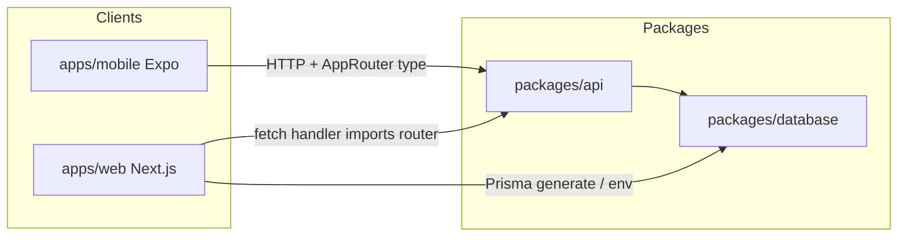

# Ivy Turborepo: Next.js + tRPC + Prisma + Expo

## Target layout

```text
ivy-mobile-app/                 # monorepo root (new)
├── turbo.json
├── package.json                # workspaces: apps/*, packages/*
├── apps/
│   ├── mobile/                 # current Expo app (moved)
│   └── web/                    # new Next.js (App Router)
└── packages/
    ├── database/               # Prisma schema, client singleton, mysql2
    ├── api/                      # tRPC init, routers, AppRouter (server + types)
    └── typescript-config/      # optional shared tsconfigs (mirrors your boilerplates)
```



## 1. Monorepo root

- Add root `[package.json](ivy-mobile-app/package.json)` with `"private": true`, `workspaces: ["apps/*", "packages/*"]`, scripts `dev` / `build` / `lint` via `turbo run ...`, and `packageManager` (your other repos use `npm@10.9.2`).
- Add `[turbo.json](ivy-mobile-app/turbo.json)` modeled on [turbopack-boilerplate-next-expo-apps/turbo.json](/Users/jojovera/Documents/turbopack-boilerplate-next-expo-apps/turbo.json): `build` outputs `.next/**`, `dev` persistent + no cache; include `DATABASE_URL` (and any API URL) in `globalEnv` / task `env` when you need cache correctness for builds.
- Replace root lockfile: run `npm install` at root after workspace layout exists (single `node_modules` at root with hoisting).

**Note:** Your git root today is `/Users/jojovera/Documents`, not `ivy-mobile-app`. After this change, consider moving git to the Ivy monorepo folder or using a dedicated repo so Turbo/workspace commands run from the correct root.

## 2. Move Expo app to `apps/mobile` (preserve behavior)

- Move everything that belongs to the mobile app into `apps/mobile/`: `[src/](ivy-mobile-app/src)`, `[app.json](ivy-mobile-app/app.json)`, `[metro.config.js](ivy-mobile-app/metro.config.js)`, `[eslint.config.js](ivy-mobile-app/eslint.config.js)`, `[tsconfig.json](ivy-mobile-app/tsconfig.json)`, `[global.css` path](ivy-mobile-app/src/global.css) (already under `src/`), assets under `src/assets`, scripts, `.env.example` (split/duplicate env docs as below).
- Set package name to something stable for workspace deps, e.g. `@ivy/mobile`.
- **Metro monorepo wiring** (required): extend config so Metro resolves hoisted deps and watches shared packages—same pattern as [Expo monorepo docs](https://docs.expo.dev/guides/monorepos/): set `watchFolders` to the monorepo root, and `resolver.nodeModulesPaths` to `[apps/mobile/node_modules, root/node_modules]` (Expo’s `getDefaultConfig` + your existing `[withUniwindConfig](ivy-mobile-app/metro.config.js)` wrapper).
- Keep `[tsconfig` paths](ivy-mobile-app/tsconfig.json) `@/* -> ./src/` relative to `apps/mobile` so imports stay unchanged.
- Root-level files to keep at repo root: `.gitignore` (merge rules for `.next`, Prisma, etc.), `turbo.json`, root `package.json`, optional `.npmrc` if you need legacy peer deps.

## 3. `packages/database` (Prisma + MySQL)

- New package (pattern from [event-stack/packages/database](/Users/jojovera/Documents/event-stack/packages/database)): `prisma/schema.prisma` with `provider = "mysql"`, `url = env("DATABASE_URL")`, `dependency mysql2`, scripts `db:generate`, `db:migrate`, `db:push`, `db:studio`.
- `src/index.ts`: Prisma singleton + `export * from '@prisma/client'` like event-stack’s `[src/index.ts](/Users/jojovera/Documents/event-stack/packages/database/src/index.ts)`.
- Start with a minimal schema (e.g. placeholder model or empty after first migration) so the stack boots; you evolve models separately.

## 4. `packages/api` (tRPC shared by web + mobile)

- Dependencies: `@trpc/server`, `zod`, `@ivy/database` (workspace).
- Export `appRouter`, `createTRPCContext`, and `type AppRouter = typeof appRouter` from a single entry (e.g. `src/index.ts`).
- Put routers under `src/routers/`; wire a minimal `health` or `hello` procedure first.
- **Why a package:** Next can import the router in the API route; Expo only needs **types** (`import type { AppRouter }`) plus `@trpc/client` / `@trpc/react-query` / `@tanstack/react-query` at runtime—no Prisma on the device.

## 5. `apps/web` (Next.js + TypeScript + tRPC)

- Create Next.js App Router app (TypeScript), aligned with versions you use elsewhere (e.g. Next 15/16 + React 19 to stay close to Expo 54’s React 19).
- Dependencies: `@ivy/api`, `@ivy/database` (if needed for scripts only), `@trpc/server`, `@trpc/client`, `@trpc/react-query`, `@trpc/next` _or_ pure App Router + `fetchRequestHandler` (event-stack uses the latter in `[route.ts](/Users/jojovera/Documents/event-stack/apps/web/src/app/api/trpc/[trpc]/route.ts)`—simplest and avoids Pages router).
- Add `app/api/trpc/[trpc]/route.ts` that calls `fetchRequestHandler` with `appRouter` and `createContext` from `@ivy/api`.
- Add client provider: `QueryClientProvider` + `trpc.Provider` + `httpBatchLink` pointing at `/api/trpc` for same-origin web.
- `postinstall` (or Turbo `dependsOn` + script): `prisma generate` with `--schema` pointing at `packages/database/prisma/schema.prisma` so Vercel/CI get a client (same idea as [event-stack web postinstall](/Users/jojovera/Documents/event-stack/apps/web/package.json)).

## 6. Mobile: call the API when you are ready

- Add `EXPO_PUBLIC_API_URL` to `[apps/mobile` env example](ivy-mobile-app/.env.example) (e.g. `http://localhost:3000` for dev; production URL later).
- Add tRPC React client in the Expo app using `httpBatchLink` with `url: \`${process.env.EXPO_PUBLIC_API_URL}/api/trpc`and`createTRPCReact()`.
- Optional: `transformer` (e.g. superjson) if you need `Date`/`Map` on the wire—add to both server init and clients if enabled.

## 7. Environment variables

| Location                  | Purpose                                                          |
| ------------------------- | ---------------------------------------------------------------- |
| Root or `apps/web` `.env` | `DATABASE_URL` (MySQL)                                           |
| `apps/web`                | Server-only secrets as needed                                    |
| `apps/mobile`             | `EXPO_PUBLIC` (API base URL, existing YouTube placeholder, etc.) |

Document in `.env.example` files per app; keep secrets out of Turbo cache via `globalEnv` / `.env` in `turbo.json` inputs (already common pattern).

## 8. Verification

- From root: `npm run dev` runs Turbo `dev` for `web` and `mobile` (filter or parallel—your choice in `turbo.json` pipeline).
- `apps/web`: `next build` succeeds; `GET /api/trpc/...` responds.
- `apps/mobile`: `npx expo start` from package or root script; confirm Metro resolves workspace packages and Uniwind still applies.

## Scope intentionally deferred

- **Shared UI package** (`packages/ui`): not required to satisfy “website + same Expo”; add when you want cross-platform components.
- **Auth (NextAuth / Expo auth)**: wire after API shape is stable.
- **Copying event-stack domain models**: only if you want those specific tables; otherwise start with a minimal Prisma schema.
