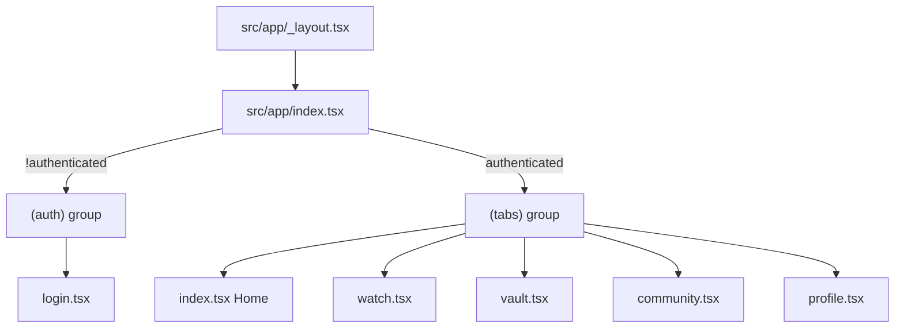

# Ivy mobile v1 — front-end scaffold and dev plan

## Context

- **Stack:** Expo SDK 54, Expo Router 6, React 19, Uniwind 1.6 + Tailwind CSS 4 (`[package.json](ivy-mobile-app/package.json)`), `[metro.config.js](ivy-mobile-app/metro.config.js)` already wires Uniwind via `[src/global.css](ivy-mobile-app/src/global.css)`.
- **Today:** Two tabs (Home + Explore) in `[src/app/(tabs)/_layout.tsx](<ivy-mobile-app/src/app/(tabs)`/layout.tsx>), starter screens using `ThemedText` / `ParallaxScrollView` (`[src/app/(tabs)/index.tsx](<ivy-mobile-app/src/app/(tabs)`/index.tsx>)).
- **Your choices:** Placeholder auth UI now with **Clerk later**; **real YouTube embed shell** with a placeholder video/live ID.

## Architecture (routes)

- **Root layout:** Keep React Navigation `ThemeProvider` in sync with the active Uniwind mode (light/dark) so stack headers and defaults match surfaces styled with `className`. Optionally call `Uniwind.setTheme('light')` on first launch if you want a fixed light default independent of the device; add **Light / Dark / System** on Profile using `Uniwind.setTheme` + `useUniwind` per [Uniwind theming basics](https://docs.uniwind.dev/theming/basics).
- **Entry redirect:** New `[src/app/index.tsx](ivy-mobile-app/src/app/index.tsx)` uses a small **mock auth context** (`isAuthenticated`, `signIn`, `signOut`) to `router.replace` either `/(auth)/login` or `/(tabs)`.
- **Auth group:** New `[src/app/(auth)/_layout.tsx](<ivy-mobile-app/src/app/(auth)`/layout.tsx>) (stack, no tab bar) and `[src/app/(auth)/login.tsx](<ivy-mobile-app/src/app/(auth)`/login.tsx>): branded layout, fake fields + “Sign in” → `signIn()`, plus a short comment block documenting future `@clerk/expo` (`ClerkProvider`, `SignedIn` / `SignedOut`, `useAuth`).
- **Tabs:** Extend `[src/app/(tabs)/_layout.tsx](<ivy-mobile-app/src/app/(tabs)`/layout.tsx>) to **five tabs** — Home, Watch, Vault, Community, Profile — with SF Symbol mappings via existing `[src/components/ui/icon-symbol.tsx](ivy-mobile-app/src/components/ui/icon-symbol.tsx)` (`house`, `play.circle`, `folder` or `archivebox`, `bubble.left.and.bubble.right` or `person.3`, `person.crop.circle`). Style tab bar with Uniwind-friendly colors (gold active, muted inactive) using `tabBarStyle` / `tabBarActiveTintColor` / `tabBarInactiveTintColor` with values derived from theme tokens or hard-coded pairs for light/dark until you centralize tokens.
- **Remove/replace** `[src/app/(tabs)/explore.tsx](<ivy-mobile-app/src/app/(tabs)`/explore.tsx>) (deleted or unused after new routes).

## Theming (Uniwind, light default, dark parity)

- **Surfaces:** Prefer `**View` / `Text` / `ScrollView` / `Pressable` + `className`** for all new Ivy UI. Use `**dark:\*\` variants for every semantic color (background, border, primary text, muted text, gold accent).
- **Tokens:** Extend `[src/global.css](ivy-mobile-app/src/global.css)` with `@theme` CSS variables for brand colors, e.g. `--ivy-gold`, `--ivy-gold-muted`, `--ivy-bg`, `--ivy-card`, so you can reference them in utilities if needed; keep day-to-day styling as Tailwind classes (`bg-white`, `dark:bg-zinc-950`, `text-amber-700`, `dark:text-amber-400`, etc.) aligned with your reference (light: white/zinc text + bronze/gold accents; dark: near-black + brighter gold).
- **React Navigation:** Build `IvyNavigationTheme` objects (light/dark) from the same hex values and pass `ThemeProvider value={...}` from `useUniwind` or `useColorScheme` so modals and any future native headers match.
- **Status bar:** Drive `expo-status-bar` `style` from active theme (light → dark content, dark → light content).
- **Expo config:** Consider changing `[app.json](ivy-mobile-app/app.json)` `userInterfaceStyle` from `"automatic"` to `"light"` only if you want the **native** root window to always start light; otherwise keep `automatic` and control appearance via Uniwind + `Appearance` (document the tradeoff in code comments).

## Typography

- Load **one serif (headings)** and **one sans (body)** via `expo-font` (e.g. `@expo-google-fonts/playfair-display` + `@expo-google-fonts/inter` or similar) in root layout with `SplashScreen.preventAutoHideAsync()` until fonts load.
- Add small wrappers or `className` conventions: e.g. `font-serif` only where Uniwind maps custom font families (follow Uniwind docs for custom font registration if required beyond Expo’s loaded names).

## Screen scaffolds (match reference layout, mock data)

| Screen        | Layout / blocks                                                                                                                                                                                                                                                                                                                            |
| ------------- | ------------------------------------------------------------------------------------------------------------------------------------------------------------------------------------------------------------------------------------------------------------------------------------------------------------------------------------------ |
| **Home**      | Safe area; header “IVY INC. SOARERS” (serif + gold); hero card “Monday Mentoring Moment” with `expo-image` placeholder, title, **gold gradient** CTA (`LinearGradient` from `expo-linear-gradient` or a styled `Pressable`); vertical list cards for “Daily Edge”, “7-Day Focus Challenge”.                                                |
| **Watch**     | Header row (title “WATCH”, search + menu icon placeholders); horizontal `ScrollView` category chips; **featured player**: `YoutubePlayer` from `react-native-youtube-iframe` with a **constant placeholder video ID** (document `EXPO_PUBLIC_YOUTUBE_PLACEHOLDER_VIDEO_ID` in `.env` / `app.config` later); grid of mock thumbnails below. |
| **Vault**     | Header + search; list rows (icon + title) for resources; one **social-style post card** (avatar, name, time, body, action row).                                                                                                                                                                                                            |
| **Community** | Header; large horizontal category cards (Discipline, Business & Wealth, Faith & Purpose); “recent activity” list.                                                                                                                                                                                                                          |
| **Profile**   | Member summary placeholder; **theme switcher** (Light / Dark / System); **Sign out** → mock `signOut()` + redirect to login.                                                                                                                                                                                                               |

All lists can use static arrays in-file or `src/data/mock/*.ts` for clarity.

## Shared components (new, under e.g. `src/components/ivy/`)

- `ScreenHeader` — title + optional left/right actions.
- `GoldButton` / `GoldGradientButton` — reusable CTA.
- `IvyCard` — rounded-2xl, border, padding, theme-aware background.
- `CategoryChips`, `VideoThumbnailCard`, `ResourceRow`, `CommunityPillarCard`, `FeedPostCard` — thin presentational pieces used across tabs.

## Dependencies to add

- `react-native-youtube-iframe` and `react-native-webview` (Expo-compatible; use a pinned version that matches Expo 54’s RN version).
- `expo-linear-gradient` for gold CTAs.
- `@expo-google-fonts/` (or equivalent) for serif + sans.

## Clerk (later) — no code in v1 beyond hooks

- Replace mock context with `ClerkProvider` in root layout, protect `(tabs)` with `SignedIn`, and map `(auth)` to `SignedOut`.
- Keep the same route groups so the file structure stays stable.

## Backend (later)

- **Option A — Next.js:** API routes + DB for posts, resources metadata, live stream schedule; app consumes via REST or tRPC client.
- **Option B — Expo API routes / edge:** If you adopt a server in the monorepo, same idea: auth (Clerk JWT), CMS-like endpoints for Vault/Community, and **YouTube** stays client-side embed; server may only store **video IDs** and “is live” flags.

## Testing / acceptance

- Run app on iOS + Android (or simulators): verify tab navigation, mock login → tabs, sign out → login, theme switch updates Uniwind classes and navigation theme, Watch player loads placeholder ID without crash.

## Files touched (summary)

- New: `src/app/index.tsx`, `src/app/(auth)/`_, `src/app/(tabs)/watch.tsx`, `vault.tsx`, `community.tsx`, `profile.tsx`, `src/contexts/auth-context.tsx`, `src/components/ivy/`_, optional `src/data/mock/\`, env example for YouTube ID.
- Edit: `[src/app/_layout.tsx](ivy-mobile-app/src/app/_layout.tsx)`, `[src/app/(tabs)/_layout.tsx](<ivy-mobile-app/src/app/(tabs)`/layout.tsx>), `[src/global.css](ivy-mobile-app/src/global.css)`, `[app.json](ivy-mobile-app/app.json)` (optional), `[package.json](ivy-mobile-app/package.json)`.
- Remove or orphan: `[src/app/(tabs)/explore.tsx](<ivy-mobile-app/src/app/(tabs)`/explore.tsx>).
